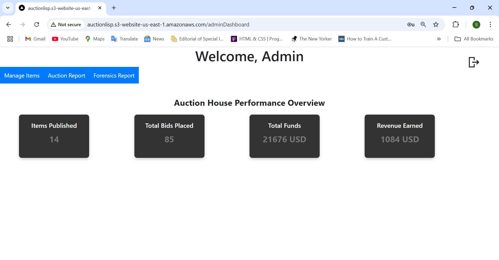
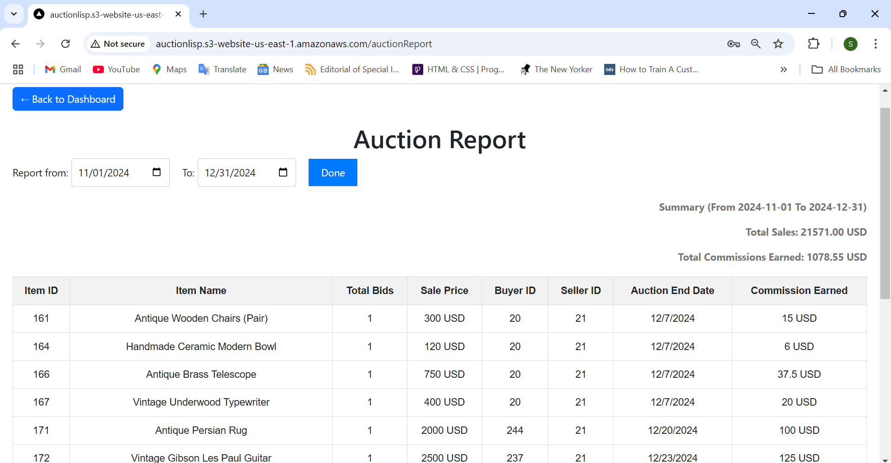
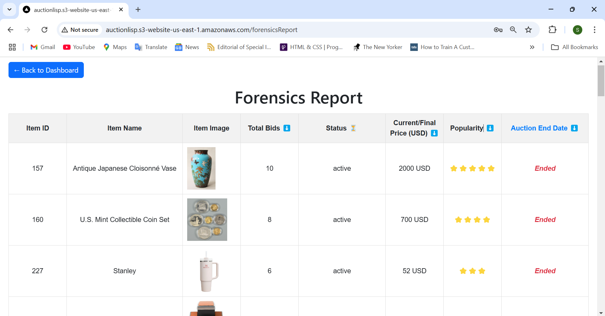
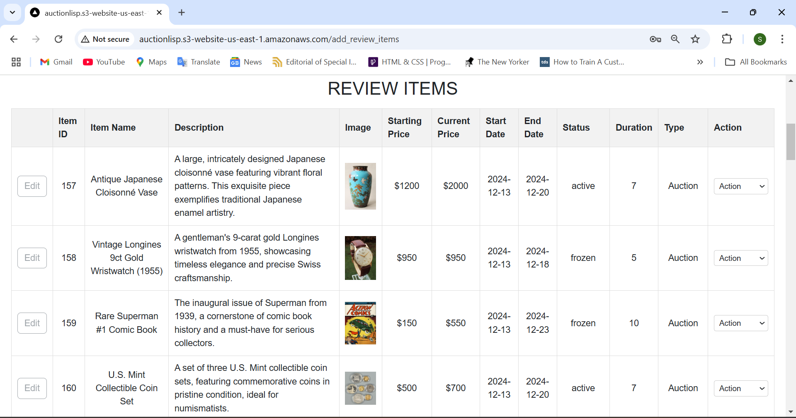
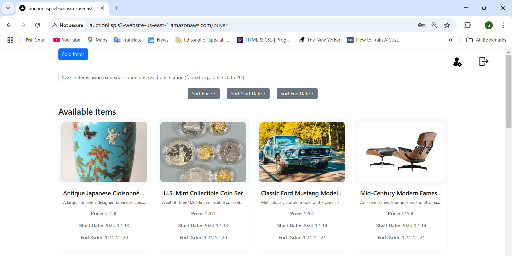
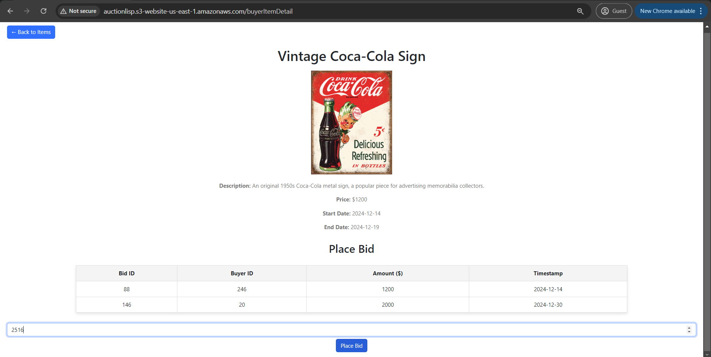
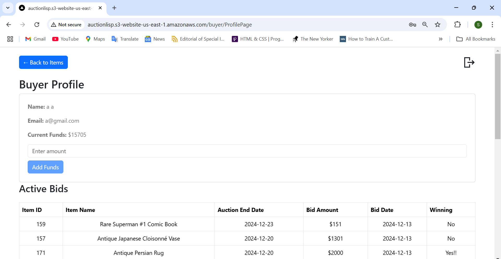
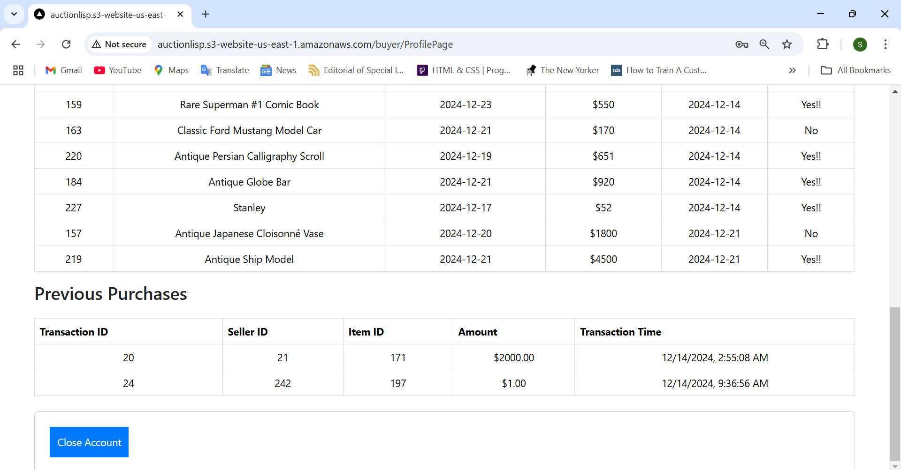

# Auction House System

This project is a full-stack web-based auction house platform that allows users to create accounts as either sellers or buyers, manage auction items, place bids, and view past sales. Sellers can create, publish, and manage items, while buyers can search for items, place bids, and review active bids. The system is built with a robust backend that supports user authentication, item listings, and real-time bidding functionality.

The platform provides the following key features:

    Seller Capabilities: Sellers can create accounts, add items, publish them for auction, manage item details (e.g., descriptions, images, initial price), and track the status of their items. Once an auction ends, the seller is responsible for fulfilling the item and shipping it to the buyer.

    Buyer Capabilities: Buyers can place bids on active items, search for items by keywords or price, and view bid histories. They can also review past purchases once the items have been fulfilled. Buyers must ensure they have enough funds to place bids.

    Admin Functionality: Admins have control over freezing or unfreezing buyer and seller accounts, freezing specific items, and generating auction reports. Admins also have access to the auction funds and can generate forensic reports.

The platform uses AWS for cloud hosting and scalable services but was taken down to avoid accruing ongoing costs, as it was incurring charges on AWS for hosting.

DEMO - https://vimeo.com/1042981102?share=copy

## Collaborators: 
  -Nitin Ghogale, Sharvi
  
  -Rana, Rohan
  
  -Rojas, Brian
  
  -Tamagnini, Antonela

## Getting Started

Clone the repository with: `[git clone https://github.com/yourusername/auction-house.git](https://github.com/brianEtrials/team-bars-lisp-auction-house.git)`. You’ll be on the main branch by default.

## Installing modules for `main`

To properly install everything, do the following:

```bash
npm install
npm install react@18 react-dom@18
npm install react-router-dom
npm install react-secure-storage
npm install bootstrap
```

Then to launch, type:

```bash
npm run dev
```

Open [http://localhost:3000](http://localhost:3000) with your browser to see the Auction House interface.

# Auction House Screenshots:

## Landing Page - Customer Page


  
## Admin Side









## Seller Side





## Buyer Side












