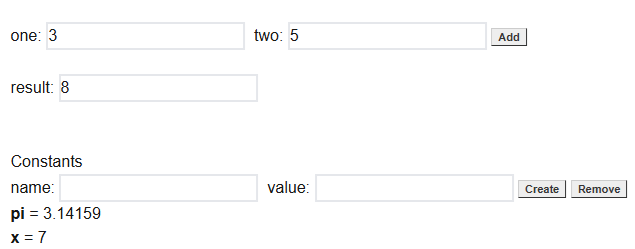
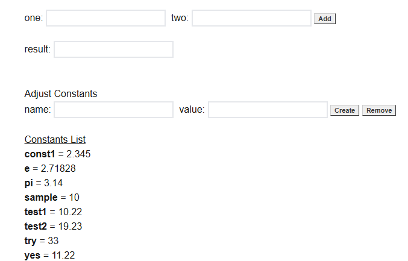

This is a stand-alone implementation of a React calculator. There are two branches in this repository (`main` and `aws`).

## Getting Started

If you simply called `git clone https://gitlab03.wpi.edu/heineman/next-calc-2024.git` then you get the default `main` branch.

## Installing modules for `main`

To properly install everything, do the following

```bash
npm install
```

Then to launch, type

```bash
npm run dev
```

Open [http://localhost:3000](http://localhost:3000) with your browser to see the result.

### Running stand-alone calculator



You can add two numbers together (like 3+5 = 8). In the above example, the user has created two constants, *pi* and *x*. You can also remove constants. If you refresh the page, all constants are lost and you start over.

Please review the code for this simple GUI.

## Installing modules for `aws`

If you enter the command `git branch -a` you can see a list of all branches. The branches shown in green are local while the red ones are remote.

```
* main
  remotes/origin/HEAD -> origin/main
  remotes/origin/aws
  remotes/origin/main
```

To move to the AWS branch, you can say `git checkout aws` which will check out the branch `aws` as found on the origin.

```
Switched to a new branch 'aws'
Branch 'aws' set up to track remote branch 'aws' from 'origin'.
```

The above shows that you are now on the `aws` branch. If you list the files in your directory (`ls` or `dir`) you can see the following 

```
11/01/2024  10:57 AM    <DIR>          .
11/01/2024  10:52 AM    <DIR>          ..
11/01/2024  10:52 AM                64 .eslintrc.json
11/01/2024  10:52 AM               502 .gitignore
11/01/2024  10:57 AM    <DIR>          lambda
11/01/2024  10:52 AM               140 next.config.ts
11/01/2024  10:57 AM           199,275 package-lock.json
11/01/2024  10:57 AM               574 package.json
11/01/2024  10:52 AM               143 postcss.config.mjs
11/01/2024  10:52 AM    <DIR>          public
11/01/2024  10:57 AM               310 README.md
11/01/2024  10:57 AM    <DIR>          src
11/01/2024  10:52 AM               426 tailwind.config.ts
11/01/2024  10:52 AM               629 tsconfig.json
```

Note that the `lambda` directory is now new. In addition, the GUI has changed to connect with the back-end AWS that I have running.

Now execute `npm install` to install the necessary dependencies for the `aws` branch in NPM.

Then to launch, type

```bash
npm run dev
```

Open [http://localhost:3000](http://localhost:3000) with your browser to see the result.



Now when you run, you will see a set of constants that are loaded up from the AWS backend. When you create a constant, it becomes visible to anyone that has access to that same API.

If you want to see the status of your local repository, you can type `git branch -a` again. This time, you will see the following:

```
* aws
  main
  remotes/origin/HEAD -> origin/main
  remotes/origin/aws
  remotes/origin/main
```

The asterisk shows that you are on the `aws` branch, though you also have the `main` branch locally available if you would like to continue working on it.